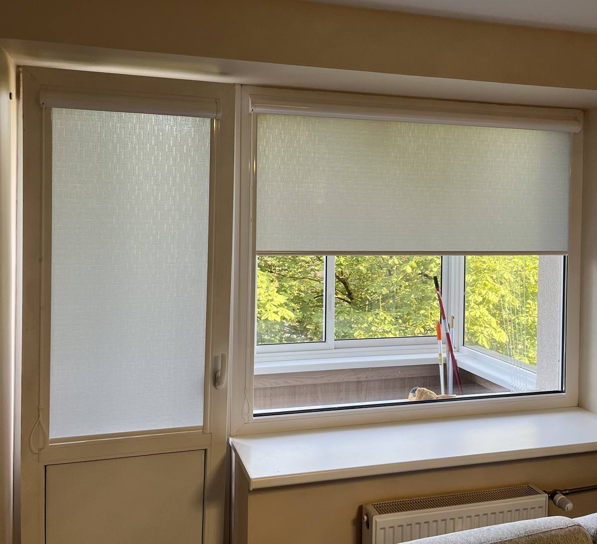
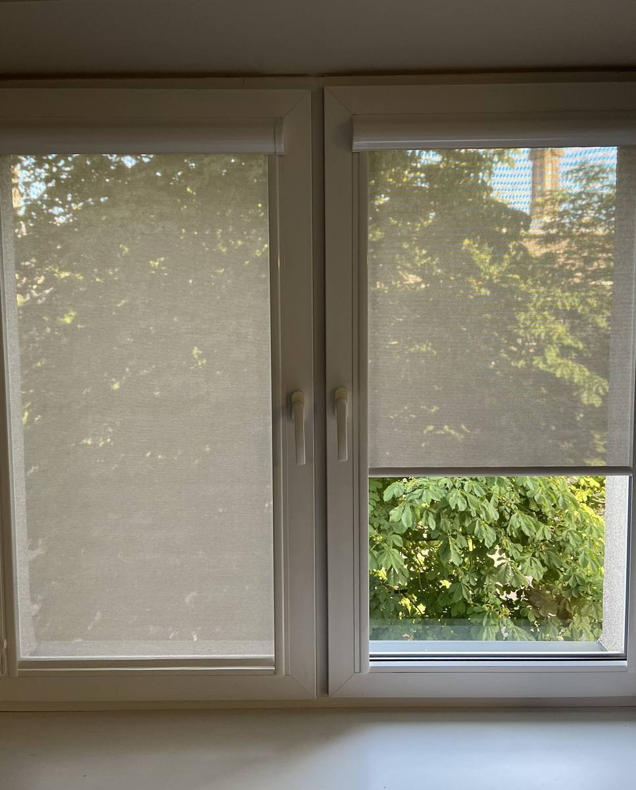

# ManttеX Website — Complete Project Codex

**Handoff document for any AI assistant taking over this project.**
Last updated: 2026-09-24

---

## What is this project

Static HTML website for **ManttеX** — a Lithuanian company that manufactures and installs
roller blinds (roletai), venetian blinds (žaliuzės), and insect screen frames (tinkleliai).
Operates in Kaunas and Klaipėda, Lithuania.

**Language of website:** Lithuanian
**Language of this document:** English (for AI handoff clarity)

---

## How to run locally

```
cd C:\Users\gmant\manttex-website
python -m http.server 8080
```
Then open `http://localhost:8080` in a browser.

No build step. No npm. No framework. Pure HTML/CSS/JS.

---

## File structure

```
C:\Users\gmant\manttex-website\
├── index.html                    Main page (homepage)
├── style.css                     All styles — single file, v=10 in cache-busting params
├── animations.js                 Popup, cookie banner, work-hours indicator, floating button — v=6
├── main.js                       General JS logic
├── turinys.js                    All text content (Lithuanian)
├── logo.png                      Header logo (883x206px)
├── baltaslogo.png                Footer logo white version (v=2)
├── logo.svg                      SVG version of logo (not used in HTML)
├── logo-footer.svg               SVG footer logo (not used in HTML)
├── optimize_images.py            Python script that was used to compress images
├── preview_ikonos.html           Dev-only preview file for icons, not linked from site
├── produktas.html                Template/prototype page (not linked from nav)
├── produktas.js                  JS for the template above
│
├── visi-produktai.html           All 11 products catalog page
├── atsiliepimai.html             Reviews page (10 real reviews from paslaugos.lt)
├── darbu-pavyzdziai.html         Work gallery page — ALL IMAGES INTEGRATED ✓
│
├── PRODUCT PAGES (roletai):
│   ├── kasetiniai.html           Cassette blinds — HAS gallery images ✓
│   ├── klasikiniai.html          Classic blinds — NO gallery images ✗
│   ├── diena-naktis.html         Day/Night blinds — HAS gallery images ✓
│   └── silumai-atspariai.html    Heat-resistant blinds — NO gallery images ✗
│
├── PRODUCT PAGES (žaliuzės):
│   ├── horizontalios-zaliuzes.html   Horizontal — NO gallery images ✗
│   ├── plisuotos-zaliuzes.html       Pleated — HAS gallery images ✓
│   ├── medines-zaliuzes.html         Wooden — HAS gallery images ✓
│   └── vertikalios-zaliuzes.html     Vertical — HAS gallery images ✓
│
├── PRODUCT PAGES (tinkleliai):
│   ├── tinkleliai-remeliai.html  Frame screens — HAS gallery images ✓
│   ├── tinkleliai-durims.html    Door screens — NO gallery images ✗
│   └── tinkleliai-roletai.html   Roller screens — NO gallery images ✗
│
├── backup/                       Old HTML versions — ignore
│
└── nuotraukos/                   All photos
    ├── darbai/                   Original photos (large, ~300KB–1MB each)
    │   ├── diena-naktis/         37 photos
    │   ├── kasetiniai/           45 photos (2 are 0-byte corrupt: IMG_1782, IMG_3004)
    │   ├── medines/              2 photos
    │   ├── plisuotos/            6 photos
    │   ├── tinkleliai-remeliai/  4 photos
    │   └── vertikalios/          7 photos
    └── optimized/                Compressed versions (~50–200KB) — USE THESE in HTML
        ├── diena-naktis/         37 photos
        ├── kasetiniai/           43 photos (the 2 corrupt ones excluded)
        ├── medines/              2 photos
        ├── plisuotos/            6 photos
        ├── tinkleliai-remeliai/  4 photos
        └── vertikalios/          7 photos
```

**Important:** Always reference `nuotraukos/optimized/...` in HTML, never `nuotraukos/darbai/...`.

---

## Pages — navigation structure

All pages share the same header nav and footer. The nav has 3 dropdown groups:

- **Roletai** → kasetiniai, klasikiniai, diena-naktis, silumai-atspariai
- **Žaliuzės** → horizontalios, plisuotos, medines, vertikalios
- **Tinkleliai** → remeliai, durims, roletai

Plus top-level links: **Visi produktai**, **Darbų pavyzdžiai**, **Atsiliepimai**

---

## CSS / JS notes

### CSS variables (defined in style.css :root)
```css
--accent: #C2852A      /* brand orange */
--dark2:  #292524
--gray:   #F5F5F4
--text:   #1C1917
```

### Cache-busting versions in every HTML file
```html
<link rel="stylesheet" href="style.css?v=10">
<script src="animations.js?v=6"></script>

```
If you edit style.css or animations.js, increment the version number in ALL HTML files.

### Footer logo — critical CSS fix
The `.footer-logo-img` must have `align-self: flex-start` in CSS.
Without it, `flex-direction: column` stretches the image to full column width.
Also uses inline style: `style="height: 44px; width: auto;"` on every footer ``.

### Floating button
Created by JavaScript in animations.js — NOT in HTML.
Uses `position: fixed`. The `pageFadeIn` animation only uses `opacity`, never `transform`,
because `transform` on `<body>` breaks `position: fixed`.

### Dropdown arrow icons
All `.dd-icon-wrap` elements have class `dd-orange` (brand color #C2852A).

### Buttons
- Primary CTA: `class="btn btn-primary btn-lg"` — orange background
- Outline dark: `class="btn btn-outline btn-lg"` with `style="border-color:rgba(255,255,255,0.4); color:#fff;"`
- **No arrow icons** (`→`) on any CTA button — they were removed

---

## Lithuanian characters — CRITICAL RULE

**NEVER use em dash `—` or en dash `–` in HTML source files.**
Use HTML entities for all Lithuanian special characters:

| Character | Entity  |
|-----------|---------|
| ū         | `&#363;` |
| į         | `&#303;` |
| š         | `&#353;` |
| ž         | `&#382;` |
| ą         | `&#261;` |
| ė         | `&#279;` |
| ų         | `&#371;` |
| č         | `&#269;` |

Wrong entities that look similar but are WRONG: `&#251;` (û), `&#237;` (í) — do not use.

For bulk file edits use PowerShell:
```powershell
$text = [System.IO.File]::ReadAllText("file.html", [System.Text.Encoding]::UTF8)
$text = $text.Replace("old", "new")
[System.IO.File]::WriteAllText("file.html", $text, [System.Text.Encoding]::UTF8)
```

---

## Contact info used across all pages

- **Phone / WhatsApp:** +370 687 65 507
- **Email:** info@manttex.lt
- **Kaunas address:** Jonavos g. 254, Kaunas
- **Klaipėda address:** J. Janonio g. 19, Klaipėda
- **Facebook:** https://www.facebook.com/Manttex
- **Instagram:** `href="#"` — PLACEHOLDER, real URL not yet set

---

## GDPR / Cookie banner

Lives in animations.js. Uses `localStorage` key: `manttex_cookie`.
Shows on first visit, disappears on accept.

## Work-hours indicator

Green/red dot in header. Green = Mon–Fri 08:00–18:00 Lithuanian time. Red = otherwise.
Also lives in animations.js.

---

## Reviews page (atsiliepimai.html)

10 real reviews from paslaugos.lt, newest first:

1. Giedrius B. — Rol&#371; gamyba — 2026-06-11
2. Karolis K. — &#381;aliuzi&#371; gamyba — 2026-04-06
3. Lena — Rol&#371; gamyba — 2026-03-24
4. Vytautas — Rol&#371; gamyba — 2025-12-30
5. Aida — Rol&#371; gamyba — 2025-10-15
6. &#381;ivil&#279; V. — Rol&#371; remontas — 2025-10-15
7. Rasa D. — Rol&#371; gamyba — 2025-09-29
8. Milda S. — Rol&#371; gamyba — 2025-08-29
9. Raminta — Tinkleliai nuo uod&#371; — 2024-05-13
10. Alenas M. — Rol&#371; gamyba — 2023-12-19

Cards use colored left-stripe classes: `stripe-red`, `stripe-blue`, `stripe-green`, `stripe-yellow`.
Card structure: left side = name + service + date. Right side = ★★★★★ + "Atsiliepimas i&#353; paslaugos.lt".

Homepage teaser shows 3 of them (Giedrius B., Karolis K., Vytautas).

---

## Footer structure (same in all 17+ HTML files)

3 columns:
1. **Brand** — logo + tagline + Facebook + Instagram
2. **Kontaktai** — Kaunas block + Klaip&#279;da block (address + phone + email)
3. **Nar&#353;ymas** — nav links including "Visi produktai"

---

## What is DONE

- [x] All 17 HTML pages created with consistent nav + footer
- [x] Homepage (index.html) — hero, products section (3 cards + all-products link), reviews teaser, CTA
- [x] visi-produktai.html — all 11 products in 3 category groups
- [x] atsiliepimai.html — 10 real reviews
- [x] darbu-pavyzdziai.html — full work gallery with filter tabs, ALL images integrated
- [x] kasetiniai.html — product page WITH gallery (thumbnails + main image)
- [x] diena-naktis.html — product page WITH gallery
- [x] plisuotos-zaliuzes.html — product page WITH gallery
- [x] medines-zaliuzes.html — product page WITH gallery
- [x] vertikalios-zaliuzes.html — product page WITH gallery
- [x] tinkleliai-remeliai.html — product page WITH gallery
- [x] Cookie banner (GDPR)
- [x] Work-hours dot indicator
- [x] Floating contact button (JS-generated)
- [x] Lithuanian HTML entity fix across all files
- [x] Images optimized (optimized/ subfolder, ~75% size reduction)

---

## What is MISSING / TODO

### High priority
- [ ] **5 product pages still need gallery images added:**
  - `klasikiniai.html` — no photos exist yet (no folder in nuotraukos/)
  - `silumai-atspariai.html` — no photos exist yet
  - `horizontalios-zaliuzes.html` — no photos exist yet
  - `tinkleliai-durims.html` — no photos exist yet
  - `tinkleliai-roletai.html` — no photos exist yet
  - Note: if owner provides photos, add to `nuotraukos/darbai/<category>/`, run optimize_images.py, then reference `nuotraukos/optimized/` in HTML

- [ ] **SEO meta tags missing from all pages**
  - index.html has only `<meta name="viewport">`, no description, no og:tags
  - Each page needs: `<meta name="description">`, `<meta property="og:title">`, `<meta property="og:description">`, `<meta property="og:image">`

- [ ] **Instagram URL** — currently `href="#"` in all page footers

### Medium priority
- [ ] **WhatsApp / Viber floating button** — not yet built. Phone: +370 687 65 507
- [ ] **Google Maps embed** in contact section (currently just text addresses)
- [ ] **Company registration code** (&#237;mon&#279;s kodas) in footer — owner must provide

### Low priority
- [ ] **favicon** — no favicon.ico or .png yet
- [ ] Remove dev/unused files: `preview_ikonos.html`, `produktas.html`, `produktas.js`, `logo.svg`, `logo-footer.svg`, `optimize_images.py` (these are not linked from the site)

---

## How product pages with gallery are structured

Look at kasetiniai.html lines 105+ as the reference pattern:

```html
<div class="pdp-gallery">
  <div class="pdp-gallery-main">
    
  </div>
  <div class="pdp-gallery-thumbs">
    
    
    <!-- ... more thumbs ... -->
  </div>
</div>
```

The thumbnail click → main image swap logic is in main.js.

---

## How to add SEO meta to a page

Add inside `<head>`, after the viewport meta:

```html
<meta name="description" content="Kasetiniai roletai - ManttеX gamina ir montuoja aukštos kokyb&#279;s kasetinius roletus Kaune ir Klaip&#279;doje.">
<meta property="og:title" content="Kasetiniai roletai - ManttеX">
<meta property="og:description" content="...">
<meta property="og:image" content="nuotraukos/optimized/kasetiniai/IMG_0045.jpeg">
<meta property="og:type" content="website">
```

---

## How to add WhatsApp floating button

In animations.js, near the existing floating button code, add:

```javascript
const wa = document.createElement('a');
wa.href = 'https://wa.me/37068765507';
wa.target = '_blank';
wa.className = 'float-whatsapp';
wa.innerHTML = '<svg ...whatsapp icon...>';
document.body.appendChild(wa);
```

Add CSS in style.css:
```css
.float-whatsapp {
  position: fixed;
  bottom: 90px; /* above the existing button */
  right: 24px;
  width: 52px; height: 52px;
  background: #25D366;
  border-radius: 50%;
  display: flex; align-items: center; justify-content: center;
  z-index: 9999;
  box-shadow: 0 4px 12px rgba(0,0,0,.2);
}
```

---

## Backup folder

`backup/` contains old versions of pages from before the current design.
Some have different names (`lauko.html`, `romanetes.html`, `zaliuzes.html`, `tinkleliai.html`)
that no longer exist in the main folder — these were consolidated.
Do not restore or link these; they are for reference only.
